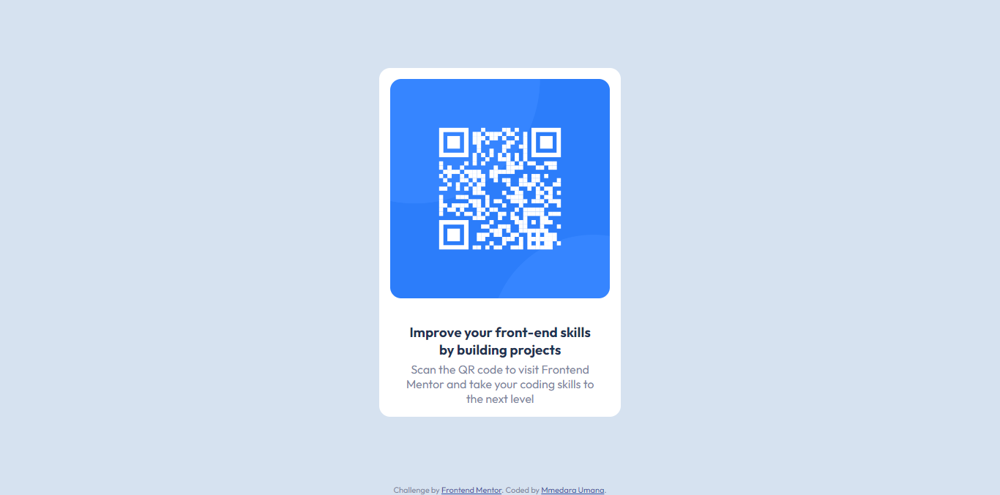

# Frontend Mentor - QR code component solution

This is a solution to the [QR code component challenge on Frontend Mentor](https://www.frontendmentor.io/challenges/qr-code-component-iux_sIO_H). Frontend Mentor challenges help you improve your coding skills by building realistic projects. 

- [Frontend Mentor - QR code component solution](#frontend-mentor---qr-code-component-solution)
  - [Overview](#overview)
    - [Screenshot](#screenshot)
    - [Links](#links)
  - [My process](#my-process)
    - [Built with](#built-with)
    - [My experience](#my-experience)
    - [Continued development](#continued-development)
    - [Useful resources](#useful-resources)
  - [Author](#author)

## Overview

### Screenshot

### Links

- Solution URL: [Solution URL](https://www.frontendmentor.io/solutions/qr-component-built-using-flexbox-lJSUUu7VQa)
- Live Site URL: [Add live site URL here](https://mmedarau.github.io/qr-component/)

## My process

### Built with

- Semantic HTML5 markup (as much as I can remember, honestly)
- CSS
- Flexbox
- Sass/SCSS (which i think was a bit much, but I'm afraid I've gotten used to using it)

### My experience
This is honestly the first project I've had the courage to do in a while. I took an involuntary break from coding due to school, and I'm honestly surprised I remember anything. I've recently spent my time re-learning old concepts 'cause I forgot so much. 

I did start with the HTML because i find that establishing structure first makes things easier in the long run. The CSS took me longer because I forgot so much about Flexbox. I actually had to go back to the books that helped me learn just to try to remember some things.

### Continued development

I want to actually to focus on Flexbox and CSS as whole. I'd like to explore more about it and get to understand it better.

### Useful resources
The Resources I used while building. I learn better by reading so most of the resources I might list over the course of doing Frontend Mentor Projects will be books.

- [Understanding Flexbox by Ohans Emmanuel](https://ohansemmanuel.github.io/uf_download.html)
- [Unraveling Flexbox by Landon Schropp](https://unravelingflexbox.com/)

These books do a really good job at explaining flexbox in a way that's easy to understand and follow. They even come with mini-projects to practice.

## Author

- Hashnode - [Mmedara Umana](https://mmedaraumana.hashnode.dev/)
- Frontend Mentor - [@MmedaraU](https://www.frontendmentor.io/profile/MmedaraU)
- Twitter - [@MmedaraUmana](https://twitter.com/MmedaraUmana)
- Github - [MmedaraU](https://github.com/MmedaraU)

